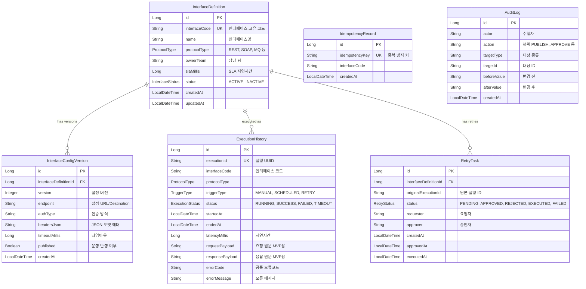

# 보험사 금융 IT 인터페이스 통합관리시스템 ERD 및 Entity 설계

이 문서는 현재 MVP와 향후 Phase 3~4 확장을 포함한 Entity 설계 기준입니다.

현재 구현 상태:

- `InterfaceDefinition`: 구현됨
- `InterfaceConfigVersion`: 구현됨
- `ExecutionHistory`: 구현됨
- `IdempotencyRecord`: 구현됨, Phase 3 로직 연결 예정
- `RetryTask`: 구현됨, Phase 3 로직 연결 예정
- `AuditLog`: 구현됨, Phase 4 로직 연결 예정

---

## 1. ERD

주의:

- `ExecutionHistory`는 MVP에서 `interfaceCode` 문자열을 저장한다.
- ERD상 `InterfaceDefinition`과 실행 이력은 논리 관계가 있지만, 현재 DB FK는 없다.
- 운영 환경에서는 실행 당시의 인터페이스 코드와 설정 버전을 스냅샷으로 남기는 것이 안전하다.

---

## 2. Entity 상세 설계

### 2.1 Core: 인터페이스 설정

#### InterfaceDefinition

인터페이스의 메타데이터를 관리한다.

주요 책임:

- 인터페이스 고유 코드 관리
- 프로토콜 타입 관리
- 담당 팀과 SLA 기준 관리
- 활성/비활성 상태 관리

실수 가능 포인트:

- `interfaceCode` unique 제약이 없으면 운영자가 같은 인터페이스를 중복 등록할 수 있다.
- 담당 팀이나 SLA 없이 운영하면 장애 발생 시 소유자와 기준 시간을 추적하기 어렵다.

#### InterfaceConfigVersion

프로토콜별 상세 설정을 버전별로 관리한다.

주요 책임:

- endpoint 관리
- 인증 방식 관리
- 헤더 JSON 관리
- timeout 관리
- 운영 반영 여부 관리

실수 가능 포인트:

- 설정을 버전으로 관리하지 않으면 장애 발생 시 어떤 설정으로 실행됐는지 재현하기 어렵다.
- `published=true` 설정이 여러 개면 실행 기준이 흔들린다.

---

### 2.2 Execution: 실행 및 이력

#### ExecutionHistory

모든 실행의 시작, 종료, 성공/실패, 지연시간을 기록한다.

주요 책임:

- 실행 UUID 관리
- 실행 상태 관리
- 요청/응답 payload 저장
- 오류코드와 오류 메시지 저장

실수 가능 포인트:

- 성공 이력만 저장하면 장애 분석이 불가능하다.
- MVP에서는 payload를 DB에 저장하지만, 운영 환경에서는 개인정보 유출 위험 때문에 Object Storage 분리와 마스킹이 필요하다.

#### IdempotencyRecord

동일한 거래의 중복 실행을 방지하기 위해 idempotencyKey를 저장한다.

주요 책임:

- idempotencyKey unique 제약으로 중복 실행 차단
- interfaceCode와 함께 요청 기준 추적

왜 필요한가:

- 금융 인터페이스에서 같은 거래가 두 번 처리되면 보험 계약 상태, 보험금 지급, 정산 데이터가 중복 반영될 수 있다.
- DB unique 제약을 활용하면 동시 요청 상황에서도 원자적으로 중복을 막을 수 있다.

실수 가능 포인트:

- 애플리케이션 메모리 캐시만으로 중복을 막으면 다중 서버 환경에서 실패한다.
- idempotencyKey를 너무 넓게 잡으면 정상 재요청까지 막고, 너무 좁게 잡으면 중복을 막지 못한다.

---

### 2.3 Operations: 운영 및 감사

#### RetryTask

실패한 인터페이스 실행에 대해 운영자가 재처리를 요청하고 승인자가 승인하는 워크플로우를 관리한다.

주요 책임:

- 원본 실행 ID 관리
- 재처리 상태 관리
- 요청자/승인자 기록
- 승인/실행 시각 기록

왜 필요한가:

- 금융 시스템에서는 실패 건을 운영자가 임의로 재전송하면 감사 리스크가 크다.
- 승인 기반 재처리 구조가 있어야 장애 복구와 통제가 동시에 가능하다.

실수 가능 포인트:

- 승인 전 재처리를 허용하면 운영 사고로 이어질 수 있다.
- 원본 실행 ID를 남기지 않으면 어떤 실패 건의 재처리인지 추적하기 어렵다.

#### AuditLog

설정 변경, publish, 재처리 승인 같은 운영 행위를 별도 테이블로 기록한다.

주요 책임:

- 수행자 기록
- 행위 기록
- 대상 종류와 대상 ID 기록
- 변경 전/후 값 저장

왜 필요한가:

- 보험/금융 IT에서는 “누가, 언제, 무엇을 바꿨는지”를 감사에서 설명할 수 있어야 한다.
- 운영 행위와 비즈니스 데이터 이력을 분리하면 조회와 보존 정책을 다르게 가져갈 수 있다.

실수 가능 포인트:

- AuditLog를 단순 application log로만 남기면 검색, 보존, 감사 제출이 어렵다.
- 민감정보를 beforeValue/afterValue에 그대로 저장하면 감사 로그 자체가 보안 리스크가 된다.

---

## 3. Phase 3~4 구현 제안

### 3.1 Phase 3: IdempotencyRecord 연결

구현 순서:

1. 실행 요청 DTO에 `idempotencyKey` 필드 추가
2. 실행 전 `IdempotencyRecordRepository.existsByIdempotencyKey()` 확인
3. 존재하면 `DUPLICATE_REQUEST` 오류 반환
4. 존재하지 않으면 `IdempotencyRecord` 먼저 저장
5. 이후 실행 오케스트레이터 진행

주의:

- 저장과 실행 사이에 장애가 나면 “중복 방지 키는 저장됐지만 실행은 실패” 상태가 생길 수 있다.
- 이 경우 실행 상태와 idempotency 상태를 함께 관리하는 개선이 필요하다.

### 3.2 Phase 3: RetryTask 연결

구현 순서:

1. 실패한 `ExecutionHistory` 기준 재처리 요청 API 추가
2. `RetryTask.request()`로 PENDING 상태 저장
3. 승인 API에서 `approve()` 호출
4. 승인된 RetryTask만 재실행 허용
5. 재실행 성공 시 `markExecuted()` 호출
6. 재실행 실패 시 `markFailed()` 호출

주의:

- 재처리 실행은 반드시 원본 실행 이력과 연결되어야 한다.
- 승인자와 요청자가 같은 사람이어도 되는지 정책을 먼저 정해야 한다.

### 3.3 Phase 4: AuditLog 연결

구현 순서:

1. 설정 publish 시 `AuditLog.record()` 저장
2. 재처리 요청 시 `AuditLog.record()` 저장
3. 재처리 승인/거절 시 `AuditLog.record()` 저장
4. AuditLog 조회 API 추가

주의:

- 감사 로그 저장 실패 시 본 작업을 실패 처리할지, 별도 보상 처리를 할지 정책이 필요하다.
- 일반적으로 설정 publish와 재처리 승인은 감사 로그 저장과 같은 트랜잭션으로 묶는 것이 안전하다.

