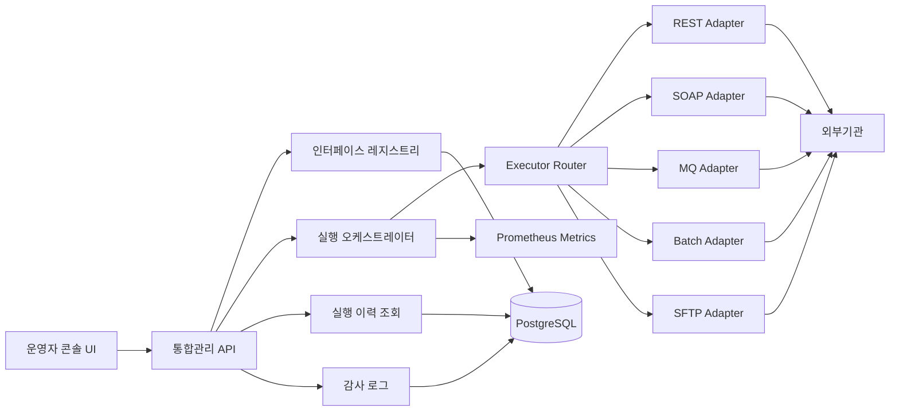

# 보험사 금융 IT 인터페이스 통합관리시스템 구현 계획서

이 문서는 Claude Code, Gemini CLI, Codex 같은 코딩 에이전트에게 구현을 맡기기 쉽도록 구조화한 작업 명세서입니다.

목표는 “보험사 내부 시스템과 외부기관 인터페이스를 통합 관리하는 Spring Boot 기반 백엔드 시스템”을 단계적으로 구현하는 것입니다.

---

## 0. 에이전트용 최상위 지시문

아래 요구사항을 기준으로 Spring Boot 기반 백엔드 프로젝트를 단계적으로 구현한다.

구현 우선순위는 다음과 같다.

1. 인터페이스 레지스트리
2. 실행 이력 저장
3. REST 인터페이스 수동 실행
4. 프로토콜 어댑터 구조
5. 재처리/재시도 구조
6. 감사 로그
7. 관제 메트릭
8. ML/LLM 운영 보조 확장

코드는 Java 21, Spring Boot 3.x 기준으로 작성한다.

초기 MVP에서는 REST 어댑터만 실제 동작하게 만들고, SOAP/MQ/Batch/SFTP는 확장 가능한 인터페이스와 스켈레톤을 먼저 만든다.

---

## 1. 프로젝트 개요

### 1.1 프로젝트명

보험사 금융 IT 인터페이스 통합관리시스템

### 1.2 목적

보험사 내부 코어 시스템과 외부기관 사이의 인터페이스를 단일 시스템에서 등록, 설정, 실행, 모니터링, 재처리, 감사할 수 있게 한다.

### 1.3 핵심 사용자

| 사용자 | 역할 |
|---|---|
| 운영자 | 인터페이스 실행, 이력 조회, 장애 확인 |
| 승인자 | 재처리 승인, 설정 반영 승인 |
| 개발자 | 인터페이스 설정 등록, 어댑터 구현 |
| 감사자 | 변경 이력, 실행 이력, 원문 조회 감사 |

### 1.4 지원 프로토콜

| 프로토콜 | MVP 구현 여부 | 설명 |
|---|---:|---|
| REST | 필수 | 초기 실제 실행 대상 |
| SOAP | 스켈레톤 | `WebServiceTemplate` 기반 확장 예정 |
| MQ | 스켈레톤 | Kafka/RabbitMQ 확장 예정 |
| Batch | 스켈레톤 | Spring Batch 확장 예정 |
| SFTP/FTP | 스켈레톤 | 파일 송수신 확장 예정 |

---

## 2. 시스템 범위

### 2.1 MVP 필수 기능

1. 인터페이스 정의 등록
2. 인터페이스 정의 조회
3. 인터페이스 설정 버전 등록
4. REST 인터페이스 수동 실행
5. 실행 성공/실패 이력 저장
6. 실행 이력 조회
7. 공통 실행 라우터 구현
8. 공통 오류코드 구조 구현

### 2.2 2차 기능

1. 재처리 요청
2. 재처리 승인 상태 관리
3. Idempotency Key 기반 중복 실행 방지
4. Resilience4j 기반 Timeout, Retry, CircuitBreaker 적용
5. AuditLog 저장
6. Prometheus 메트릭 노출

### 2.3 3차 기능

1. SOAP 어댑터 실제 구현
2. MQ 어댑터 실제 구현
3. Batch/SFTP 어댑터 실제 구현
4. DLQ 기반 실패 메시지 관리
5. Python 이상탐지 배치
6. LLM 장애 요약 API

---

## 3. 권장 기술 스택

| 영역 | 기술 |
|---|---|
| Language | Java 21 |
| Framework | Spring Boot 3.x |
| Persistence | Spring Data JPA |
| DB | PostgreSQL, 개발용 H2 가능 |
| HTTP Client | WebClient |
| Resilience | Resilience4j |
| Batch | Spring Batch |
| MQ | Kafka 또는 RabbitMQ |
| Metrics | Micrometer, Prometheus |
| Dashboard | Grafana |
| ML 보조 | Python, pandas, scikit-learn |
| LLM/RAG 보조 | LangChain 또는 LangGraph |

---

## 4. 논리 아키텍처



---

## 5. 패키지 구조 제안

```text
src/main/java/com/example/interfacehub
├── InterfaceHubApplication.java
├── domain
│   ├── interfaceconfig
│   │   ├── InterfaceDefinition.java
│   │   ├── InterfaceConfigVersion.java
│   │   ├── ProtocolType.java
│   │   └── InterfaceStatus.java
│   ├── execution
│   │   ├── ExecutionHistory.java
│   │   ├── ExecutionStatus.java
│   │   ├── ExecutionRequest.java
│   │   └── ExecutionResult.java
│   ├── retry
│   │   ├── RetryTask.java
│   │   └── RetryStatus.java
│   └── audit
│       └── AuditLog.java
├── application
│   ├── registry
│   │   └── InterfaceRegistryService.java
│   ├── execution
│   │   ├── ExecutionOrchestrator.java
│   │   ├── ExecutorRouter.java
│   │   └── InterfaceExecutor.java
│   ├── retry
│   │   └── RetryService.java
│   └── audit
│       └── AuditLogService.java
├── adapter
│   ├── rest
│   │   └── RestInterfaceExecutor.java
│   ├── soap
│   │   └── SoapInterfaceExecutor.java
│   ├── mq
│   │   └── MqInterfaceExecutor.java
│   ├── batch
│   │   └── BatchInterfaceExecutor.java
│   └── sftp
│       └── SftpInterfaceExecutor.java
├── infrastructure
│   ├── persistence
│   │   ├── InterfaceDefinitionRepository.java
│   │   ├── InterfaceConfigVersionRepository.java
│   │   ├── ExecutionHistoryRepository.java
│   │   └── AuditLogRepository.java
│   ├── client
│   │   └── WebClientConfig.java
│   └── resilience
│       └── ResilienceConfig.java
└── presentation
    ├── InterfaceRegistryController.java
    ├── ExecutionController.java
    └── HistoryController.java
```

---

## 6. 도메인 모델 명세

### 6.1 InterfaceDefinition

인터페이스의 기본 정보를 저장한다.

| 필드 | 타입 | 필수 | 설명 |
|---|---|---:|---|
| id | Long | Y | PK |
| interfaceCode | String | Y | 인터페이스 고유 코드 |
| name | String | Y | 인터페이스 이름 |
| protocolType | Enum | Y | REST, SOAP, MQ, BATCH, SFTP |
| ownerTeam | String | Y | 담당 팀 |
| slaMillis | Long | N | SLA 기준 지연시간 |
| status | Enum | Y | ACTIVE, INACTIVE |
| createdAt | LocalDateTime | Y | 생성일 |
| updatedAt | LocalDateTime | Y | 수정일 |

### 6.2 InterfaceConfigVersion

인터페이스별 실행 설정을 버전으로 관리한다.

| 필드 | 타입 | 필수 | 설명 |
|---|---|---:|---|
| id | Long | Y | PK |
| interfaceDefinitionId | Long | Y | 인터페이스 FK |
| version | Integer | Y | 설정 버전 |
| endpoint | String | Y | 외부기관 URL 또는 목적지 |
| authType | String | N | 인증 방식 |
| headersJson | String | N | HTTP Header JSON |
| timeoutMillis | Long | Y | 타임아웃 |
| scheduleCron | String | N | 스케줄 |
| published | Boolean | Y | 운영 반영 여부 |
| createdAt | LocalDateTime | Y | 생성일 |

### 6.3 ExecutionHistory

인터페이스 실행 결과를 저장한다.

| 필드 | 타입 | 필수 | 설명 |
|---|---|---:|---|
| id | Long | Y | PK |
| executionId | String | Y | 실행 UUID |
| interfaceCode | String | Y | 인터페이스 코드 |
| protocolType | Enum | Y | 실행 프로토콜 |
| status | Enum | Y | SUCCESS, FAILED, TIMEOUT |
| triggerType | Enum | Y | MANUAL, SCHEDULED, RETRY |
| startedAt | LocalDateTime | Y | 시작 시각 |
| endedAt | LocalDateTime | N | 종료 시각 |
| latencyMillis | Long | N | 지연시간 |
| requestPayloadRef | String | N | 원문 저장 위치 |
| responsePayloadRef | String | N | 응답 저장 위치 |
| errorCode | String | N | 공통 오류코드 |
| errorMessage | String | N | 오류 메시지 |

### 6.4 AuditLog

설정 변경, 실행 승인, 권한 변경 같은 감사 이벤트를 저장한다.

| 필드 | 타입 | 필수 | 설명 |
|---|---|---:|---|
| id | Long | Y | PK |
| actor | String | Y | 수행자 |
| action | String | Y | 행위 |
| targetType | String | Y | 대상 종류 |
| targetId | String | Y | 대상 ID |
| beforeValue | String | N | 변경 전 값 |
| afterValue | String | N | 변경 후 값 |
| createdAt | LocalDateTime | Y | 생성일 |

---

## 7. API 명세

### 7.1 인터페이스 등록

```http
POST /api/v1/interfaces
Content-Type: application/json

{
  "interfaceCode": "FSS_POLICY_REPORT",
  "name": "금감원 보험계약 보고",
  "protocolType": "REST",
  "ownerTeam": "PolicyCore",
  "slaMillis": 3000
}
```

성공 응답:

```json
{
  "id": 1,
  "interfaceCode": "FSS_POLICY_REPORT",
  "status": "ACTIVE"
}
```

### 7.2 설정 버전 등록

```http
POST /api/v1/interfaces/{interfaceCode}/configs
Content-Type: application/json

{
  "endpoint": "https://external.example.com/report",
  "authType": "API_KEY",
  "headers": {
    "X-API-KEY": "masked-value"
  },
  "timeoutMillis": 3000
}
```

### 7.3 설정 운영 반영

```http
POST /api/v1/interfaces/{interfaceCode}/configs/{configId}/publish
```

주의:

- 운영 반영 시 기존 published 설정은 false로 변경한다.
- AuditLog를 반드시 저장한다.

### 7.4 인터페이스 수동 실행

```http
POST /api/v1/interfaces/{interfaceCode}/execute
Content-Type: application/json

{
  "idempotencyKey": "POLICY-20260422-0001",
  "payload": {
    "policyNo": "P202604220001",
    "eventType": "NEW_CONTRACT"
  }
}
```

성공 응답:

```json
{
  "executionId": "b8fdc9f4-9a20-4e1f-8c47-6d55e4d18111",
  "status": "SUCCESS",
  "latencyMillis": 245
}
```

실패 응답:

```json
{
  "executionId": "b8fdc9f4-9a20-4e1f-8c47-6d55e4d18111",
  "status": "FAILED",
  "errorCode": "EXT_5XX",
  "errorMessage": "External agency returned 500"
}
```

### 7.5 실행 이력 조회

```http
GET /api/v1/interfaces/{interfaceCode}/histories?from=2026-04-01&to=2026-04-22&status=FAILED&page=0&size=20
```

---

## 8. 핵심 구현 계약

### 8.1 InterfaceExecutor

```java
public interface InterfaceExecutor {
    ProtocolType supportType();

    ExecutionResult execute(ExecutionContext context);
}
```

구현 의도:

- 프로토콜별 실행 방식을 공통 계약으로 추상화한다.
- 오케스트레이터는 REST, SOAP, MQ 같은 세부 기술을 몰라도 된다.
- 새로운 프로토콜은 `InterfaceExecutor` 구현체 추가만으로 확장한다.

### 8.2 ExecutorRouter

```java
@Component
@RequiredArgsConstructor
public class ExecutorRouter {

    private final List<InterfaceExecutor> executors;

    public ExecutionResult routeAndExecute(ExecutionContext context) {
        return executors.stream()
            .filter(executor -> executor.supportType() == context.protocolType())
            .findFirst()
            .orElseThrow(() -> new UnsupportedProtocolException(context.protocolType()))
            .execute(context);
    }
}
```

### 8.3 ExecutionOrchestrator 책임

`ExecutionOrchestrator`는 다음 흐름을 담당한다.

1. 인터페이스 정의 조회
2. published 설정 버전 조회
3. idempotencyKey 중복 확인
4. ExecutionHistory 시작 이력 저장
5. ExecutorRouter로 실행 위임
6. 성공/실패 결과 저장
7. 메트릭 기록
8. 실패 시 RetryTask 또는 DLQ 후보 등록

---

## 9. 단계별 구현 태스크

### Phase 1. Spring Boot MVP

목표:

- REST 인터페이스를 등록하고 수동 실행할 수 있다.
- 실행 결과가 DB에 저장된다.

작업:

1. Spring Boot 프로젝트 생성
2. JPA, Web, Validation 의존성 추가
3. `InterfaceDefinition` 엔티티 구현
4. `InterfaceConfigVersion` 엔티티 구현
5. `ExecutionHistory` 엔티티 구현
6. Repository 구현
7. 등록/조회 API 구현
8. 실행 API 구현
9. REST 어댑터 구현
10. 실행 이력 조회 API 구현

완료 기준:

- `POST /api/v1/interfaces`로 인터페이스 등록 가능
- `POST /api/v1/interfaces/{interfaceCode}/configs`로 설정 등록 가능
- `POST /api/v1/interfaces/{interfaceCode}/execute`로 REST 호출 가능
- 성공/실패 이력이 DB에 저장됨

### Phase 2. 장애 방어 패턴

목표:

- 외부기관 지연이나 장애가 내부 시스템 전체 장애로 번지지 않게 한다.

작업:

1. Resilience4j 의존성 추가
2. Timeout 설정 추가
3. Retry 설정 추가
4. CircuitBreaker 설정 추가
5. 공통 오류코드 정의
6. 외부기관 4xx, 5xx, timeout 예외 매핑
7. 테스트 코드 작성

완료 기준:

- timeout 발생 시 `TIMEOUT` 상태로 이력 저장
- 외부 5xx 발생 시 `EXT_5XX` 오류코드 저장
- CircuitBreaker open 상태에서 빠르게 실패 처리

### Phase 3. 중복 실행 방지와 재처리

목표:

- 동일 거래가 중복 처리되지 않게 한다.
- 실패 건을 승인 기반으로 재처리할 수 있다.

작업:

1. `IdempotencyRecord` 엔티티 추가
2. idempotencyKey unique 제약 추가
3. 실행 전 중복 체크 구현
4. `RetryTask` 엔티티 추가
5. 재처리 요청 API 구현
6. 재처리 승인 API 구현
7. 승인된 재처리 실행 API 구현
8. AuditLog 저장

완료 기준:

- 같은 idempotencyKey로 두 번 실행하면 두 번째 요청은 차단
- 실패 이력 기준으로 재처리 요청 생성 가능
- 승인된 재처리만 실행 가능

### Phase 4. 관제와 감사

목표:

- 운영자가 실패율, 지연시간, 장애 상태를 볼 수 있다.
- 감사자가 설정 변경과 재처리 승인 이력을 추적할 수 있다.

작업:

1. Micrometer 메트릭 추가
2. 실행 성공/실패 카운터 추가
3. 지연시간 timer 추가
4. AuditLog API 구현
5. 설정 publish 시 AuditLog 저장
6. 재처리 승인 시 AuditLog 저장

완료 기준:

- `/actuator/prometheus`에서 메트릭 확인 가능
- 설정 변경 이력이 AuditLog에 저장됨
- 재처리 승인 이력이 AuditLog에 저장됨

### Phase 5. 확장 어댑터

목표:

- REST 외 프로토콜을 같은 구조로 확장할 수 있다.

작업:

1. `SoapInterfaceExecutor` 스켈레톤 구현
2. `MqInterfaceExecutor` 스켈레톤 구현
3. `BatchInterfaceExecutor` 스켈레톤 구현
4. `SftpInterfaceExecutor` 스켈레톤 구현
5. unsupported 기능은 명확한 오류코드 반환

완료 기준:

- 모든 어댑터가 `InterfaceExecutor`를 구현
- 아직 미구현인 프로토콜은 `NOT_IMPLEMENTED` 오류코드 반환
- 오케스트레이터 코드는 프로토콜 추가 시 변경하지 않음

---

## 10. 테스트 전략

### 10.1 단위 테스트

| 대상 | 테스트 |
|---|---|
| ExecutorRouter | 프로토콜별 Executor 선택 |
| ExecutionOrchestrator | 성공/실패 이력 저장 |
| IdempotencyService | 중복 key 차단 |
| RetryService | 승인 전 실행 차단 |

### 10.2 통합 테스트

| 대상 | 테스트 |
|---|---|
| REST 실행 API | MockWebServer로 외부기관 응답 테스트 |
| 설정 publish | 기존 published 설정 비활성화 확인 |
| 실행 이력 조회 | 기간, 상태, 페이징 필터 확인 |
| AuditLog | 설정 변경/재처리 승인 로그 확인 |

### 10.3 장애 테스트

| 시나리오 | 기대 결과 |
|---|---|
| 외부기관 timeout | `TIMEOUT` 이력 저장 |
| 외부기관 500 | `EXT_5XX` 이력 저장 |
| 잘못된 endpoint | `CONNECTION_ERROR` 저장 |
| 중복 idempotencyKey | 두 번째 실행 차단 |
| 미구현 프로토콜 실행 | `NOT_IMPLEMENTED` 반환 |

---

## 11. 오류코드 표준

| 오류코드 | 의미 | 예시 |
|---|---|---|
| `IF_NOT_FOUND` | 인터페이스 없음 | 잘못된 interfaceCode |
| `CONFIG_NOT_FOUND` | published 설정 없음 | 설정 등록 전 실행 |
| `UNSUPPORTED_PROTOCOL` | 지원하지 않는 프로토콜 | 정의되지 않은 enum |
| `NOT_IMPLEMENTED` | 스켈레톤만 있고 실제 구현 없음 | SOAP 미구현 |
| `TIMEOUT` | 외부기관 응답 지연 | timeoutMillis 초과 |
| `EXT_4XX` | 외부기관 4xx | 인증 실패, 잘못된 요청 |
| `EXT_5XX` | 외부기관 5xx | 외부기관 서버 오류 |
| `CONNECTION_ERROR` | 연결 실패 | DNS, 네트워크 오류 |
| `DUPLICATE_REQUEST` | 중복 요청 | 같은 idempotencyKey |
| `REPROCESS_NOT_APPROVED` | 승인되지 않은 재처리 | 승인 전 재실행 |

---

## 12. 보안/감사 요구사항

### 12.1 반드시 지켜야 할 규칙

- 요청/응답 원문은 DB에 직접 저장하지 않는다.
- 주민번호, 계좌번호, 카드번호, 전화번호는 로그 출력 전에 마스킹한다.
- 설정 변경은 반드시 AuditLog를 남긴다.
- 재처리는 반드시 승인 상태를 거친다.
- 원문 다운로드 기능은 MVP에서 제외한다.

### 12.2 마스킹 예시

```java
public class SensitiveDataMasker {

    public String mask(String input) {
        if (input == null) {
            return null;
        }

        return input
            .replaceAll("\\d{6}-\\d{7}", "******-*******")
            .replaceAll("\\d{3}-\\d{2}-\\d{5,}", "***-**-*****");
    }
}
```

주의:

- 정규식 마스킹만으로 모든 개인정보를 잡을 수 없다.
- 운영 환경에서는 필드 기반 마스킹과 패턴 기반 마스킹을 함께 적용해야 한다.

---

## 13. ML/LLM/Agent 확장 계획

### 13.1 Python 이상탐지

목표:

- 실행 이력 데이터를 기반으로 비정상 지연시간, 실패율 증가, timeout 증가를 탐지한다.

입력 데이터:

```csv
execution_id,interface_code,latency_ms,error_rate,timeout_count,created_at
```

예시 코드:

```python
import pandas as pd
from sklearn.ensemble import IsolationForest

df = pd.read_csv("execution_metrics.csv")
features = df[["latency_ms", "error_rate", "timeout_count"]]

model = IsolationForest(contamination=0.02, random_state=42)
df["anomaly"] = model.fit_predict(features)

alerts = df[df["anomaly"] == -1]
print(alerts.tail(10))
```

주의:

- ML 결과만으로 자동 재처리하면 안 된다.
- 이상탐지는 운영자가 확인할 후보를 줄이는 용도로만 사용한다.

### 13.2 LLM 장애 요약

목표:

- 최근 실패 이력을 RCA 형식으로 요약한다.

요약 출력 형식:

```text
장애 요약:
- 장애 시간:
- 영향 인터페이스:
- 주요 오류코드:
- 추정 원인:
- 즉시 조치:
- 재발 방지:
```

주의:

- LLM 입력 전 개인정보를 제거한다.
- LLM 답변에는 반드시 executionId, errorCode, 로그 근거를 포함한다.
- LLM은 승인이나 재처리를 직접 수행하면 안 된다.

---

## 14. 에이전트에게 줄 수 있는 작업 프롬프트

### 14.1 MVP 구현 프롬프트

```text
이 저장소에 Java 21, Spring Boot 3.x 기반 백엔드 프로젝트를 구현해줘.

목표는 보험사 금융 IT 인터페이스 통합관리시스템 MVP야.

우선 구현 범위는 다음과 같아.
1. InterfaceDefinition 엔티티와 등록/조회 API
2. InterfaceConfigVersion 엔티티와 설정 등록/publish API
3. ExecutionHistory 엔티티와 실행 이력 조회 API
4. InterfaceExecutor 공통 인터페이스
5. ExecutorRouter
6. RestInterfaceExecutor
7. ExecutionOrchestrator
8. REST 인터페이스 수동 실행 API

DB는 개발 편의를 위해 H2를 사용하고, JPA 기반으로 구현해줘.
패키지 구조는 문서의 "패키지 구조 제안"을 따라줘.
테스트는 최소한 ExecutorRouter, ExecutionOrchestrator, REST 실행 API 통합 테스트를 작성해줘.
```

### 14.2 장애 방어 구현 프롬프트

```text
기존 Spring Boot 프로젝트에 Resilience4j 기반 장애 방어 패턴을 추가해줘.

구현할 내용은 다음과 같아.
1. 외부 REST 호출 timeout
2. retry
3. circuit breaker
4. 외부기관 4xx/5xx/timeout 예외를 공통 오류코드로 매핑
5. 실패 시 ExecutionHistory에 상태와 오류코드 저장

테스트는 timeout, 500 응답, circuit breaker open 케이스를 포함해줘.
```

### 14.3 재처리/감사 구현 프롬프트

```text
기존 프로젝트에 중복 실행 방지, 재처리 승인, 감사 로그 기능을 추가해줘.

구현할 내용은 다음과 같아.
1. IdempotencyRecord 엔티티
2. idempotencyKey unique 제약
3. 중복 요청 차단
4. RetryTask 엔티티
5. 재처리 요청 API
6. 재처리 승인 API
7. 승인된 재처리 실행 API
8. AuditLog 엔티티와 저장 로직

재처리는 승인 전에는 실행되면 안 돼.
설정 publish와 재처리 승인 시 AuditLog를 반드시 저장해줘.
```

---

## 15. 구현 시 금지사항

- 프로토콜별 실행 로직을 하나의 서비스에 `if-else`로 몰아넣지 않는다.
- 요청/응답 원문 전체를 DB 컬럼에 저장하지 않는다.
- 재처리 API를 승인 없이 바로 실행 가능하게 만들지 않는다.
- 외부기관 오류를 단순 `RuntimeException`으로만 처리하지 않는다.
- 개인정보가 포함된 payload를 그대로 로그에 출력하지 않는다.
- 테스트 없이 핵심 실행 로직을 구현 완료로 간주하지 않는다.

---

## 16. 최종 완료 기준

최소 완료 기준:

- 인터페이스 등록 가능
- 설정 버전 등록 가능
- 설정 publish 가능
- REST 인터페이스 수동 실행 가능
- 실행 성공/실패 이력 저장 가능
- 실행 이력 조회 가능
- 공통 실행 라우터 구조 완성
- REST 외 프로토콜 확장 스켈레톤 존재

품질 완료 기준:

- 주요 서비스 단위 테스트 존재
- REST 실행 API 통합 테스트 존재
- 공통 오류코드 적용
- 개인정보 마스킹 유틸 존재
- AuditLog 구조 존재
- README에 실행 방법 정리

