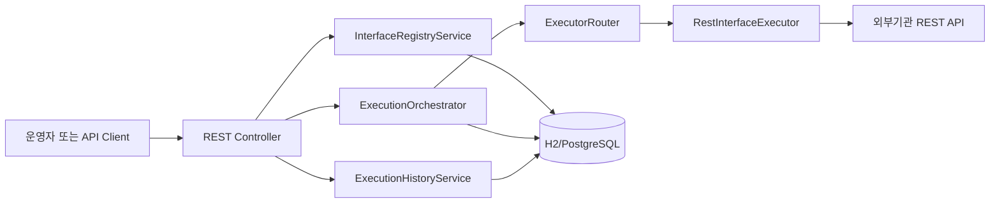

# 보험사 금융 IT 인터페이스 통합관리시스템 MVP 구축 명세서

이 문서는 실제 MVP 구현을 시작하기 위한 실행 명세서입니다.

현재 상태:

- MVP 코드는 아직 구축하지 않았다.
- 기존 파일 `insurance_interface_management_plan.md`는 전체 구조화 계획서다.
- 이 문서는 MVP만 따로 떼어 구현 순서, 기능 범위, API, DB, 테스트 기준을 정의한다.

---

## 1. MVP 목표

### 1.1 MVP에서 만들 것

보험사 외부기관 인터페이스를 등록하고, REST 방식으로 수동 실행하며, 실행 결과를 DB에 저장하고 조회할 수 있는 최소 백엔드 시스템을 만든다.

### 1.2 MVP 핵심 기능

1. 인터페이스 등록
2. 인터페이스 목록/상세 조회
3. 인터페이스 설정 버전 등록
4. 설정 버전 publish
5. REST 인터페이스 수동 실행
6. 실행 성공/실패 이력 저장
7. 실행 이력 조회
8. 공통 프로토콜 실행 라우터 구현
9. REST 어댑터 구현
10. 기본 오류코드 처리

### 1.3 MVP에서 제외할 것

- 로그인/회원가입
- RBAC 권한 관리
- 재처리 승인 워크플로우
- Kafka/RabbitMQ 실제 연동
- SOAP 실제 연동
- SFTP 실제 연동
- Spring Batch 실제 잡 구성
- Grafana 대시보드
- ML 이상탐지
- LLM 장애 요약
- 원문 Object Storage 저장

제외 이유:

- MVP의 핵심은 “등록 → 설정 → 실행 → 이력 저장” 흐름을 먼저 검증하는 것이다.
- 재처리, 감사, 관제, ML/LLM은 실행 이력이 쌓인 뒤 확장하는 것이 자연스럽다.

---

## 2. 기술 스택

| 영역 | 선택 |
|---|---|
| Language | Java 21 |
| Framework | Spring Boot 3.x |
| Build Tool | Gradle 또는 Maven |
| DB | H2 우선, PostgreSQL 전환 가능 구조 |
| ORM | Spring Data JPA |
| HTTP Client | Spring WebClient |
| Validation | Jakarta Bean Validation |
| Test | JUnit 5, Spring Boot Test |
| API 문서 | 선택: Springdoc OpenAPI |

---

## 3. MVP 아키텍처



### 3.1 구현 흐름

1. 운영자가 인터페이스를 등록한다.
2. 운영자가 인터페이스 실행 설정을 등록한다.
3. 운영자가 설정을 publish 한다.
4. 운영자가 수동 실행 API를 호출한다.
5. 시스템은 published 설정을 조회한다.
6. 시스템은 프로토콜 타입에 맞는 executor를 찾는다.
7. REST executor가 외부기관 API를 호출한다.
8. 성공/실패 결과를 `ExecutionHistory`에 저장한다.
9. 운영자는 실행 이력을 조회한다.

---

## 4. 패키지 구조

```text
src/main/java/com/example/interfacehub
├── InterfaceHubApplication.java
├── domain
│   ├── interfaceconfig
│   │   ├── InterfaceDefinition.java
│   │   ├── InterfaceConfigVersion.java
│   │   ├── ProtocolType.java
│   │   └── InterfaceStatus.java
│   └── execution
│       ├── ExecutionHistory.java
│       ├── ExecutionStatus.java
│       ├── TriggerType.java
│       ├── ExecutionContext.java
│       └── ExecutionResult.java
├── application
│   ├── registry
│   │   └── InterfaceRegistryService.java
│   └── execution
│       ├── InterfaceExecutor.java
│       ├── ExecutorRouter.java
│       ├── ExecutionOrchestrator.java
│       └── ExecutionHistoryService.java
├── adapter
│   └── rest
│       └── RestInterfaceExecutor.java
├── infrastructure
│   ├── persistence
│   │   ├── InterfaceDefinitionRepository.java
│   │   ├── InterfaceConfigVersionRepository.java
│   │   └── ExecutionHistoryRepository.java
│   └── client
│       └── WebClientConfig.java
├── presentation
│   ├── InterfaceRegistryController.java
│   ├── ExecutionController.java
│   └── ExecutionHistoryController.java
└── common
    ├── error
    │   ├── ErrorCode.java
    │   ├── BusinessException.java
    │   └── GlobalExceptionHandler.java
    └── time
        └── TimeProvider.java
```

---

## 5. DB 모델

### 5.1 interface_definition

| 컬럼 | 타입 | 제약 | 설명 |
|---|---|---|---|
| id | BIGINT | PK | 내부 ID |
| interface_code | VARCHAR(100) | UNIQUE, NOT NULL | 인터페이스 코드 |
| name | VARCHAR(200) | NOT NULL | 인터페이스 이름 |
| protocol_type | VARCHAR(30) | NOT NULL | REST, SOAP, MQ, BATCH, SFTP |
| owner_team | VARCHAR(100) | NOT NULL | 담당 팀 |
| sla_millis | BIGINT | NULL | SLA 기준 |
| status | VARCHAR(30) | NOT NULL | ACTIVE, INACTIVE |
| created_at | TIMESTAMP | NOT NULL | 생성일 |
| updated_at | TIMESTAMP | NOT NULL | 수정일 |

### 5.2 interface_config_version

| 컬럼 | 타입 | 제약 | 설명 |
|---|---|---|---|
| id | BIGINT | PK | 내부 ID |
| interface_definition_id | BIGINT | FK, NOT NULL | 인터페이스 ID |
| version | INT | NOT NULL | 설정 버전 |
| endpoint | VARCHAR(1000) | NOT NULL | 외부기관 URL |
| auth_type | VARCHAR(50) | NULL | 인증 방식 |
| headers_json | CLOB/TEXT | NULL | Header JSON |
| timeout_millis | BIGINT | NOT NULL | 타임아웃 |
| published | BOOLEAN | NOT NULL | 운영 반영 여부 |
| created_at | TIMESTAMP | NOT NULL | 생성일 |

권장 제약:

- `(interface_definition_id, version)` unique
- 한 인터페이스에는 published=true 설정이 하나만 있어야 한다.

### 5.3 execution_history

| 컬럼 | 타입 | 제약 | 설명 |
|---|---|---|---|
| id | BIGINT | PK | 내부 ID |
| execution_id | VARCHAR(100) | UNIQUE, NOT NULL | 실행 UUID |
| interface_code | VARCHAR(100) | NOT NULL | 인터페이스 코드 |
| protocol_type | VARCHAR(30) | NOT NULL | 실행 프로토콜 |
| trigger_type | VARCHAR(30) | NOT NULL | MANUAL, SCHEDULED, RETRY |
| status | VARCHAR(30) | NOT NULL | SUCCESS, FAILED, TIMEOUT |
| started_at | TIMESTAMP | NOT NULL | 시작 시각 |
| ended_at | TIMESTAMP | NULL | 종료 시각 |
| latency_millis | BIGINT | NULL | 실행 시간 |
| request_payload | CLOB/TEXT | NULL | MVP용 요청 원문 |
| response_payload | CLOB/TEXT | NULL | MVP용 응답 원문 |
| error_code | VARCHAR(100) | NULL | 오류코드 |
| error_message | VARCHAR(1000) | NULL | 오류 메시지 |

주의:

- MVP에서는 단순화를 위해 payload를 DB에 저장할 수 있다.
- 실제 운영에서는 request/response 원문을 DB에 저장하지 말고 Object Storage에 저장해야 한다.
- 개인정보가 포함될 수 있으므로 운영 전 마스킹 처리가 필요하다.

---

## 6. API 명세

### 6.1 인터페이스 등록

```http
POST /api/v1/interfaces
Content-Type: application/json
```

요청:

```json
{
  "interfaceCode": "FSS_POLICY_REPORT",
  "name": "금감원 보험계약 보고",
  "protocolType": "REST",
  "ownerTeam": "PolicyCore",
  "slaMillis": 3000
}
```

응답:

```json
{
  "id": 1,
  "interfaceCode": "FSS_POLICY_REPORT",
  "name": "금감원 보험계약 보고",
  "protocolType": "REST",
  "status": "ACTIVE"
}
```

### 6.2 인터페이스 목록 조회

```http
GET /api/v1/interfaces
```

응답:

```json
[
  {
    "id": 1,
    "interfaceCode": "FSS_POLICY_REPORT",
    "name": "금감원 보험계약 보고",
    "protocolType": "REST",
    "ownerTeam": "PolicyCore",
    "status": "ACTIVE"
  }
]
```

### 6.3 인터페이스 상세 조회

```http
GET /api/v1/interfaces/{interfaceCode}
```

### 6.4 설정 버전 등록

```http
POST /api/v1/interfaces/{interfaceCode}/configs
Content-Type: application/json
```

요청:

```json
{
  "endpoint": "https://external.example.com/report",
  "authType": "API_KEY",
  "headers": {
    "X-API-KEY": "sample-key"
  },
  "timeoutMillis": 3000
}
```

응답:

```json
{
  "configId": 1,
  "interfaceCode": "FSS_POLICY_REPORT",
  "version": 1,
  "published": false
}
```

### 6.5 설정 publish

```http
POST /api/v1/interfaces/{interfaceCode}/configs/{configId}/publish
```

응답:

```json
{
  "configId": 1,
  "interfaceCode": "FSS_POLICY_REPORT",
  "version": 1,
  "published": true
}
```

### 6.6 인터페이스 수동 실행

```http
POST /api/v1/interfaces/{interfaceCode}/execute
Content-Type: application/json
```

요청:

```json
{
  "payload": {
    "policyNo": "P202604220001",
    "eventType": "NEW_CONTRACT"
  }
}
```

성공 응답:

```json
{
  "executionId": "b8fdc9f4-9a20-4e1f-8c47-6d55e4d18111",
  "status": "SUCCESS",
  "latencyMillis": 245
}
```

실패 응답:

```json
{
  "executionId": "b8fdc9f4-9a20-4e1f-8c47-6d55e4d18111",
  "status": "FAILED",
  "errorCode": "EXT_5XX",
  "errorMessage": "External server error"
}
```

### 6.7 실행 이력 조회

```http
GET /api/v1/interfaces/{interfaceCode}/histories?page=0&size=20
```

추가 필터:

```http
GET /api/v1/interfaces/{interfaceCode}/histories?status=FAILED&from=2026-04-01&to=2026-04-22&page=0&size=20
```

---

## 7. 핵심 클래스 설계

### 7.1 InterfaceExecutor

```java
public interface InterfaceExecutor {
    ProtocolType supportType();

    ExecutionResult execute(ExecutionContext context);
}
```

왜 필요한가:

- REST, SOAP, MQ, Batch, SFTP 실행 방식을 공통 계약으로 묶기 위해 필요하다.
- 나중에 프로토콜이 추가되어도 오케스트레이터를 수정하지 않기 위해 필요하다.

### 7.2 ExecutorRouter

```java
@Component
@RequiredArgsConstructor
public class ExecutorRouter {

    private final List<InterfaceExecutor> executors;

    public ExecutionResult routeAndExecute(ExecutionContext context) {
        return executors.stream()
            .filter(executor -> executor.supportType() == context.protocolType())
            .findFirst()
            .orElseThrow(() -> new BusinessException(ErrorCode.UNSUPPORTED_PROTOCOL))
            .execute(context);
    }
}
```

주의:

- 프로토콜별 분기를 `if-else`로 작성하지 않는다.
- executor가 없으면 명확한 오류코드로 실패시킨다.

### 7.3 ExecutionOrchestrator

책임:

1. 인터페이스 정의 조회
2. published 설정 조회
3. 실행 시작 이력 저장
4. `ExecutionContext` 생성
5. `ExecutorRouter` 호출
6. 실행 성공/실패 이력 업데이트
7. API 응답 반환

주의:

- 외부기관 호출 예외가 발생해도 실행 이력은 반드시 남겨야 한다.
- 성공과 실패 모두 `ExecutionHistory`에 기록해야 한다.

### 7.4 RestInterfaceExecutor

책임:

1. endpoint로 HTTP POST 요청 전송
2. headers 적용
3. payload 전송
4. response body 반환
5. timeout 처리

초기 구현 예시:

```java
@Component
@RequiredArgsConstructor
public class RestInterfaceExecutor implements InterfaceExecutor {

    private final WebClient.Builder webClientBuilder;

    @Override
    public ProtocolType supportType() {
        return ProtocolType.REST;
    }

    @Override
    public ExecutionResult execute(ExecutionContext context) {
        long start = System.currentTimeMillis();

        String response = webClientBuilder.build()
            .post()
            .uri(context.endpoint())
            .headers(headers -> headers.addAll(context.headers()))
            .bodyValue(context.payload())
            .retrieve()
            .bodyToMono(String.class)
            .block(Duration.ofMillis(context.timeoutMillis()));

        long latency = System.currentTimeMillis() - start;
        return ExecutionResult.success(response, latency);
    }
}
```

주의:

- MVP에서는 `.block()`을 허용한다.
- 운영 수준에서는 Resilience4j, connection pool, bulkhead를 반드시 추가해야 한다.

---

## 8. 오류코드

| 코드 | HTTP Status | 의미 |
|---|---:|---|
| `IF_NOT_FOUND` | 404 | 인터페이스 없음 |
| `CONFIG_NOT_FOUND` | 404 | published 설정 없음 |
| `DUPLICATE_INTERFACE_CODE` | 409 | 인터페이스 코드 중복 |
| `UNSUPPORTED_PROTOCOL` | 400 | 지원하지 않는 프로토콜 |
| `REST_CALL_FAILED` | 502 | REST 호출 실패 |
| `TIMEOUT` | 504 | 외부기관 응답 지연 |
| `INVALID_REQUEST` | 400 | 요청값 검증 실패 |
| `INTERNAL_ERROR` | 500 | 내부 서버 오류 |

---

## 9. 구현 순서

### Step 1. 프로젝트 생성

작업:

- Spring Boot 3.x 프로젝트 생성
- Java 21 설정
- 의존성 추가

필수 의존성:

- Spring Web
- Spring WebFlux
- Spring Data JPA
- H2 Database
- Validation
- Lombok
- Spring Boot Test

완료 기준:

- 애플리케이션이 실행된다.
- `/actuator/health`는 선택사항이다.

### Step 2. 도메인/엔티티 구현

작업:

- `ProtocolType`
- `InterfaceStatus`
- `ExecutionStatus`
- `TriggerType`
- `InterfaceDefinition`
- `InterfaceConfigVersion`
- `ExecutionHistory`

완료 기준:

- 애플리케이션 시작 시 H2에 테이블이 생성된다.

### Step 3. Repository 구현

작업:

- `InterfaceDefinitionRepository`
- `InterfaceConfigVersionRepository`
- `ExecutionHistoryRepository`

필요 메서드:

```java
Optional<InterfaceDefinition> findByInterfaceCode(String interfaceCode);
boolean existsByInterfaceCode(String interfaceCode);
Optional<InterfaceConfigVersion> findByInterfaceDefinitionAndPublishedTrue(InterfaceDefinition definition);
Page<ExecutionHistory> findByInterfaceCode(String interfaceCode, Pageable pageable);
```

완료 기준:

- Repository 단위 테스트가 통과한다.

### Step 4. 인터페이스 등록/조회 구현

작업:

- `InterfaceRegistryService`
- `InterfaceRegistryController`
- DTO 구현

API:

- `POST /api/v1/interfaces`
- `GET /api/v1/interfaces`
- `GET /api/v1/interfaces/{interfaceCode}`

완료 기준:

- 인터페이스 등록, 목록 조회, 상세 조회가 가능하다.
- 중복 `interfaceCode` 등록 시 409를 반환한다.

### Step 5. 설정 버전 등록/publish 구현

작업:

- 설정 등록 API
- 설정 publish API
- 기존 published 설정 해제 로직

API:

- `POST /api/v1/interfaces/{interfaceCode}/configs`
- `POST /api/v1/interfaces/{interfaceCode}/configs/{configId}/publish`

완료 기준:

- 설정 등록 시 version이 자동 증가한다.
- publish 시 해당 인터페이스의 published 설정은 하나만 유지된다.

### Step 6. 실행 구조 구현

작업:

- `ExecutionContext`
- `ExecutionResult`
- `InterfaceExecutor`
- `ExecutorRouter`
- `ExecutionOrchestrator`
- `RestInterfaceExecutor`

완료 기준:

- `ExecutorRouter`가 REST executor를 선택한다.
- REST executor가 외부 endpoint에 POST 요청을 보낸다.
- 실행 결과가 `ExecutionResult`로 반환된다.

### Step 7. 실행 API 구현

작업:

- `ExecutionController`
- 실행 요청 DTO
- 실행 응답 DTO
- 실행 이력 저장

API:

- `POST /api/v1/interfaces/{interfaceCode}/execute`

완료 기준:

- published 설정이 없으면 `CONFIG_NOT_FOUND`를 반환한다.
- 실행 성공 시 `ExecutionHistory.status=SUCCESS`로 저장된다.
- 실행 실패 시 `ExecutionHistory.status=FAILED`로 저장된다.

### Step 8. 실행 이력 조회 구현

작업:

- `ExecutionHistoryService`
- `ExecutionHistoryController`
- 페이징 조회
- 상태 필터는 가능하면 구현

API:

- `GET /api/v1/interfaces/{interfaceCode}/histories`

완료 기준:

- interfaceCode 기준 실행 이력을 조회할 수 있다.
- 최신순 정렬을 적용한다.

### Step 9. 예외 처리 구현

작업:

- `ErrorCode`
- `BusinessException`
- `GlobalExceptionHandler`

완료 기준:

- 비즈니스 예외는 일관된 JSON 형식으로 반환된다.
- validation 오류도 일관된 형식으로 반환된다.

예시 응답:

```json
{
  "code": "IF_NOT_FOUND",
  "message": "Interface not found"
}
```

### Step 10. 테스트 작성

필수 테스트:

1. 인터페이스 등록 성공
2. 인터페이스 코드 중복 실패
3. 설정 등록 성공
4. 설정 publish 성공
5. published 설정 없는 실행 실패
6. REST 실행 성공
7. REST 실행 실패 시 이력 저장
8. 실행 이력 조회
9. ExecutorRouter가 REST executor 선택

---

## 10. 테스트 시나리오

### 10.1 정상 시나리오

1. 인터페이스 등록
2. 설정 등록
3. 설정 publish
4. mock 외부기관 API 준비
5. 인터페이스 실행
6. 실행 응답 확인
7. 실행 이력 조회

기대 결과:

- 실행 상태가 `SUCCESS`
- 지연시간이 기록됨
- 응답 payload가 저장됨

### 10.2 실패 시나리오

#### published 설정 없음

조건:

- 인터페이스는 등록되어 있음
- 설정은 없거나 publish되지 않음

기대 결과:

- HTTP 404
- 오류코드 `CONFIG_NOT_FOUND`

#### 외부기관 500

조건:

- mock 외부기관 API가 500 반환

기대 결과:

- 실행 응답 상태 `FAILED`
- 실행 이력 상태 `FAILED`
- 오류코드 `REST_CALL_FAILED`

#### 지원하지 않는 프로토콜

조건:

- interface protocolType이 SOAP이지만 SOAP executor가 없음

기대 결과:

- 실행 실패
- 오류코드 `UNSUPPORTED_PROTOCOL`

---

## 11. MVP 구현 시 주의점

### 11.1 실수 가능 포인트

- 실행 이력을 성공할 때만 저장하면 장애 분석이 불가능하다.
- 설정 publish 없이 실행 가능하게 만들면 운영 설정 기준이 흔들린다.
- REST 호출 실패 예외를 그대로 던지면 API 응답이 일관되지 않는다.
- 프로토콜별 로직을 controller에 넣으면 확장성이 무너진다.
- payload를 운영 로그에 그대로 출력하면 개인정보 노출 위험이 있다.

### 11.2 MVP 허용사항

- H2 DB 사용 가능
- `.block()` 사용 가능
- request/response payload DB 저장 가능
- 인증/권한 생략 가능
- REST만 실제 구현 가능

### 11.3 MVP 이후 반드시 개선할 것

- PostgreSQL 전환
- Flyway/Liquibase 도입
- Resilience4j 도입
- Idempotency Key 도입
- AuditLog 도입
- payload Object Storage 분리
- 개인정보 마스킹
- Prometheus/Grafana 관제

---

## 12. Claude Code/Gemini용 구현 프롬프트

아래 프롬프트를 그대로 복사해서 사용할 수 있다.

```text
현재 저장소에 보험사 금융 IT 인터페이스 통합관리시스템 MVP를 구현해줘.

기술 스택:
- Java 21
- Spring Boot 3.x
- Spring Data JPA
- H2 Database
- WebClient
- Validation
- JUnit 5

구현 범위:
1. InterfaceDefinition 등록/조회
2. InterfaceConfigVersion 등록/publish
3. ExecutionHistory 저장/조회
4. InterfaceExecutor 공통 인터페이스
5. ExecutorRouter
6. ExecutionOrchestrator
7. RestInterfaceExecutor
8. REST 인터페이스 수동 실행 API
9. 공통 ErrorCode, BusinessException, GlobalExceptionHandler
10. 핵심 테스트

패키지 구조는 `mvp_build_plan.md`의 패키지 구조를 따라줘.

MVP 제약:
- REST만 실제 구현해.
- SOAP/MQ/Batch/SFTP는 이번 MVP에서는 구현하지 마.
- 로그인/권한은 구현하지 마.
- H2 DB를 사용해.
- request/response payload는 MVP에서는 DB에 저장해도 돼.

필수 API:
- POST /api/v1/interfaces
- GET /api/v1/interfaces
- GET /api/v1/interfaces/{interfaceCode}
- POST /api/v1/interfaces/{interfaceCode}/configs
- POST /api/v1/interfaces/{interfaceCode}/configs/{configId}/publish
- POST /api/v1/interfaces/{interfaceCode}/execute
- GET /api/v1/interfaces/{interfaceCode}/histories

완료 기준:
- 인터페이스 등록 가능
- 설정 등록 가능
- 설정 publish 가능
- published 설정 기준으로 REST 실행 가능
- 실행 성공/실패 이력이 DB에 저장됨
- 실행 이력 조회 가능
- 테스트가 통과함
```

---

## 13. 최종 MVP 완료 기준 체크리스트

- [ ] Spring Boot 애플리케이션이 실행된다.
- [ ] H2 DB 테이블이 생성된다.
- [ ] 인터페이스 등록 API가 동작한다.
- [ ] 인터페이스 목록 조회 API가 동작한다.
- [ ] 인터페이스 상세 조회 API가 동작한다.
- [ ] 설정 등록 API가 동작한다.
- [ ] 설정 publish API가 동작한다.
- [ ] REST 실행 API가 동작한다.
- [ ] 실행 성공 이력이 저장된다.
- [ ] 실행 실패 이력이 저장된다.
- [ ] 실행 이력 조회 API가 동작한다.
- [ ] 공통 오류 응답 형식이 적용된다.
- [ ] 핵심 테스트가 통과한다.

